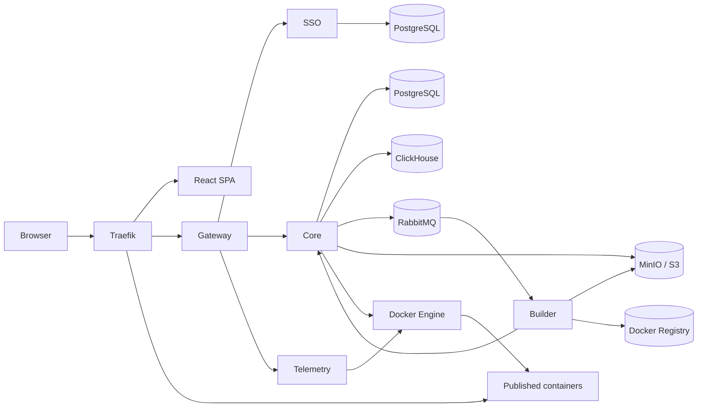

<div align="center">

# Docker Cloud Manager

**A self-hosted PaaS for running and managing containerized applications on a single server**

[](#project-status)
[](backend/go.mod)
[](frontend/package.json)
[](docker-compose.yml)
[](LICENSE)

[Русский](README.md) · **English**

</div>

Docker Cloud Manager (DCM) is an open-source, Heroku- and Railway-style platform for developers and small teams. It runs containers, Docker Compose projects, and custom images without giving users direct shell access to the server.

> [!IMPORTANT]
> The project is in development and is not yet intended for production workloads. The current single-VM deployment uses HTTP; HTTPS/ACME is not configured yet.

## Table of contents

- [Features](#features)
- [Architecture](#architecture)
- [Technology stack](#technology-stack)
- [Quick start](#quick-start)
- [Development](#development)
- [Repository structure](#repository-structure)
- [Operations and security](#operations-and-security)
- [Documentation](#documentation)
- [Project status](#project-status)
- [License](#license)

## Features

### For users

- Run standalone containers from public Docker Hub images.
- Build custom images from `.zip`, `.tar.gz`, or public HTTPS Git repositories.
- Deploy multi-container applications with Docker Compose from a YAML file, archive, or Git repository.
- Manage persistent Docker volumes, including attaching DCM volumes as `external: true` in Compose.
- Publish applications on custom subdomains through Traefik.
- View CPU, memory, and network statistics, build logs, and real-time container logs.
- Open a browser terminal for running containers through single-use stream tickets.
- Use an isolated Docker network for each user.

### For administrators

- Manage users, roles, statuses, and quotas.
- Manage resources across all users.
- Monitor server load, available capacity, and admission control.
- Review resource usage reports and audit events.
- Change runtime settings without restarting services.

## Architecture



| Component | Responsibility |
| --- | --- |
| **Gateway** | HTTP edge/API gateway, request authentication, authorization, and stream proxying |
| **SSO** | Users, roles, tokens, permissions, quotas, and OIDC identity binding |
| **Core** | Docker orchestration, resource state, admission control, Compose, builds, reports, and audit |
| **Builder** | RabbitMQ worker that builds custom images with Kaniko |
| **Telemetry** | Internal-only service for container logs and browser terminals |
| **Frontend** | React SPA for the user and administration panels |

Long-running lifecycle operations execute asynchronously through durable database state and RabbitMQ queues. PostgreSQL remains the source of truth for users and runtime resources, while ClickHouse serves as the analytical read model.

## Technology stack

| Area | Stack |
| --- | --- |
| Backend | Go, Gin, gRPC, Protocol Buffers |
| Frontend | React 19, TypeScript, Vite, Tailwind CSS |
| Frontend state | TanStack Query, Zustand |
| Data | PostgreSQL, ClickHouse |
| Queues and objects | RabbitMQ, MinIO / S3-compatible storage |
| Containers | Docker Engine API, Docker Compose, Kaniko, Docker Registry |
| Edge and publishing | Traefik |

## Quick start

### Requirements

- A Linux server with a public IPv4 or IPv6 address.
- Docker Engine and the Docker Compose plugin.
- A user with access to the Docker daemon.
- An available inbound TCP port `80`.
- A panel domain (`DCM_HOST`) and a wildcard DNS record for applications (`*.BASE_DOMAIN`).

The default domain settings use `localhost` for local evaluation. For an externally accessible deployment, point the main and wildcard domains to the server first.

### 1. Clone the repository

```bash
git clone https://github.com/callmerussell04/docker-cloud-manager.git
cd docker-cloud-manager
```

### 2. Create the configuration

```bash
cp backend/.env.example backend/.env
```

Open `backend/.env` and:

- replace every `change_me_*` value with a unique random secret;
- set `SSO_ADMIN_EMAIL` and a secure `SSO_ADMIN_PASSWORD`;
- for an external server, configure `DCM_HOST`, `BASE_DOMAIN`, `FRONTEND_API_URL`, `CORS_ALLOWED_ORIGINS`, and `GATEWAY_AUTH_REDIRECT_ALLOWED_ORIGINS`;
- keep `COOKIE_SECURE=false` only for the current HTTP deployment.

### 3. Validate and start the stack

```bash
docker compose --env-file backend/.env config --quiet
docker compose --env-file backend/.env up -d --build
```

PostgreSQL and ClickHouse migrations run automatically as one-shot services before their dependent components start.

### 4. Check the deployment

```bash
docker compose --env-file backend/.env ps
curl -fsS http://localhost/health/live
curl -fsS http://localhost/health/ready
```

Open `http://<DCM_HOST>/` and sign in with `SSO_ADMIN_USERNAME` and `SSO_ADMIN_PASSWORD` from `backend/.env`.

DNS and Docker address pools are covered in the [single-VM deployment guide](docs/deployment-single-vm.md). For common problems, see the [troubleshooting guide](docs/troubleshooting.md).

## Development

### Backend

Run backend commands from `backend/`:

```bash
cd backend

go mod tidy
go build -o bin/ ./cmd/...
GOCACHE=/tmp/go-build-cache go test ./...
GOCACHE=/tmp/go-build-cache go vet ./...
make lint
```

Run the complete integration test suite with temporary infrastructure:

```bash
cd backend
make test
```

### Frontend

```bash
cd frontend
npm ci
VITE_API_URL=http://localhost/api/v1 VITE_BASE_DOMAIN=localhost npm run dev
```

Lint and create a production build:

```bash
cd frontend
npm run lint
npm run build
```

### Full stack

From the repository root:

```bash
docker compose --env-file backend/.env up -d --build
```

## Repository structure

```text
.
├── backend/
│   ├── api/             # OpenAPI and protobuf contracts
│   ├── cmd/             # Service entry points
│   ├── internal/        # Bounded contexts and Clean Architecture layers
│   ├── migrations/      # PostgreSQL and ClickHouse migrations
│   ├── pkg/             # Shared backend packages
│   └── tests/           # Backend tests
├── frontend/
│   └── src/             # React SPA
├── docs/                # Project and deployment documentation
├── docker-compose.yml   # Complete single-VM stack
└── LICENSE
```

## Operations and security

> [!WARNING]
> `docker compose --env-file backend/.env down -v` deletes the persistent volumes that contain databases, object storage, the registry, and queues. Use `docker compose --env-file backend/.env down` for a normal shutdown.

- The current Compose stack exposes external traffic over HTTP on port `80`. Configure HTTPS and secure cookies separately before production use.
- Docker creates a separate bridge network for every user. Configure `default-address-pools` in the Docker daemon before operating the platform to prevent subnet exhaustion.
- RabbitMQ, MinIO, Registry, and Traefik administration interfaces must not be exposed publicly; the current Compose configuration binds their ports to `127.0.0.1`.
- Data remains in Docker volumes after a regular `docker compose down`.
- Access tokens, refresh cookies, internal service tokens, build arguments, and container environment values must not appear in logs.

## Documentation

- [Documentation index (Russian)](docs/README.md)
- [Single-VM deployment (Russian)](docs/deployment-single-vm.md)
- [User guide (Russian)](docs/user-guide.md)
- [Administrator guide (Russian)](docs/admin-guide.md)
- [Troubleshooting (Russian)](docs/troubleshooting.md)
- [API guide (Russian)](docs/api-guide.md)
- [HTTP API — OpenAPI 3.0](backend/api/gateway/openapi.yml)

## Project status

Docker Cloud Manager is in development. Configuration and API backward compatibility are not guaranteed yet, and the current deployment targets a single server with HTTP traffic. Evaluate the risks, configure HTTPS, and arrange backups before using the project with important data.

## License

This project is licensed under the [Apache License 2.0](LICENSE).
