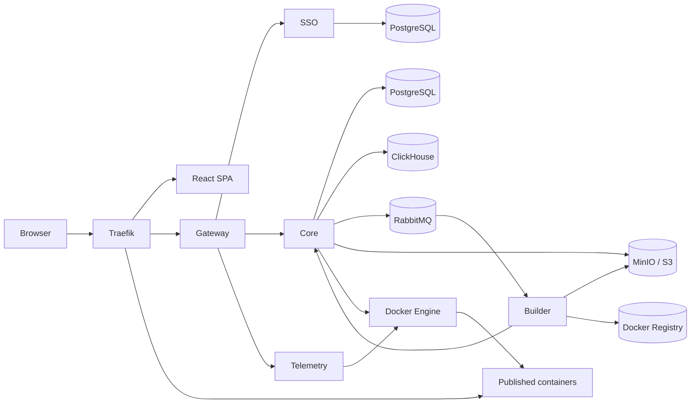

<div align="center">

# Docker Cloud Manager

**Self-hosted PaaS для запуска и управления контейнерными приложениями на одном сервере**

[](#статус-проекта)
[](backend/go.mod)
[](frontend/package.json)
[](docker-compose.yml)
[](LICENSE)

**Русский** · [English](README.en.md)

</div>

Docker Cloud Manager (DCM) — открытая платформа в стиле Heroku и Railway для разработчиков и небольших команд. Она позволяет запускать контейнеры, Docker Compose проекты и собственные образы без прямого shell-доступа к серверу.

> [!IMPORTANT]
> Проект находится в разработке. Текущий single-VM сценарий использует HTTP; HTTPS/ACME ещё не настроены.

## Содержание

- [Возможности](#возможности)
- [Архитектура](#архитектура)
- [Технологии](#технологии)
- [Быстрый старт](#быстрый-старт)
- [Разработка](#разработка)
- [Структура репозитория](#структура-репозитория)
- [Эксплуатация и безопасность](#эксплуатация-и-безопасность)
- [Документация](#документация)
- [Статус проекта](#статус-проекта)
- [Лицензия](#лицензия)

## Возможности

### Для пользователей

- Запуск одиночных контейнеров из публичных образов Docker Hub.
- Сборка собственных образов из `.zip`, `.tar.gz` или публичного HTTPS Git-репозитория.
- Развёртывание многоконтейнерных приложений через Docker Compose из YAML-файла, архива или Git-репозитория.
- Управление постоянными томами Docker, включая подключение томов DCM как `external: true` в Compose.
- Публикация приложений на пользовательских поддоменах через Traefik.
- Просмотр статистики процессора, оперативной памяти и сети, журналов сборки и контейнеров в реальном времени.
- Терминал в браузере для запущенных контейнеров.
- Изолированная Docker-сеть для каждого пользователя.

### Для администраторов

- Управление пользователями, ролями, статусами и квотами.
- Управление ресурсами всех пользователей.
- Мониторинг нагрузки, свободных ресурсов сервера и допуска новых операций.
- Отчёты об использовании ресурсов и журнал аудита.
- Изменение рабочих настроек без перезапуска служб.

## Архитектура



| Компонент | Назначение |
| --- | --- |
| **Gateway** | Пограничная служба HTTP API, аутентификация запросов, авторизация и проксирование потоковых соединений |
| **SSO** | Пользователи, роли, токены, разрешения, квоты и привязка учётных записей OIDC |
| **Core** | Оркестрация Docker, состояние ресурсов, допуск операций, Compose, сборки, отчёты и аудит |
| **Builder** | Обработчик RabbitMQ для сборки пользовательских образов через Kaniko |
| **Telemetry** | Внутренняя служба журналов контейнеров и терминала в браузере |
| **Frontend** | React SPA для пользовательской и административной панели |

## Технологии

| Область | Стек |
| --- | --- |
| Backend | Go, Gin, gRPC, Protocol Buffers |
| Frontend | React 19, TypeScript, Vite, Tailwind CSS |
| Состояние frontend | TanStack Query, Zustand |
| Данные | PostgreSQL, ClickHouse |
| Очереди и объекты | RabbitMQ, MinIO / S3-compatible storage |
| Контейнеры | Docker Engine API, Docker Compose, Kaniko, Docker Registry |
| Входящий трафик и публикация | Traefik |

## Быстрый старт

### Требования

- Linux-сервер с публичным IPv4 или IPv6.
- Docker Engine и Docker Compose plugin.
- Пользователь с доступом к Docker daemon.
- Свободный входящий TCP-порт `80`.
- Домен панели (`DCM_HOST`) и wildcard DNS-запись для приложений (`*.BASE_DOMAIN`).

Для локального ознакомления значения доменов по умолчанию используют `localhost`. Для доступного извне развёртывания заранее направьте основной и wildcard-домены на сервер.

### 1. Клонируйте репозиторий

```bash
git clone https://github.com/callmerussell04/docker-cloud-manager.git
cd docker-cloud-manager
```

### 2. Создайте конфигурацию

```bash
cp backend/.env.example backend/.env
```

Откройте `backend/.env` и:

- замените все значения `change_me_*` уникальными случайными секретами;
- задайте `SSO_ADMIN_EMAIL` и безопасный `SSO_ADMIN_PASSWORD`;
- для внешнего сервера настройте `DCM_HOST`, `BASE_DOMAIN`, `FRONTEND_API_URL`, `CORS_ALLOWED_ORIGINS` и `GATEWAY_AUTH_REDIRECT_ALLOWED_ORIGINS`;
- оставьте `COOKIE_SECURE=false` только для текущего HTTP-сценария.

### 3. Проверьте и запустите стек

```bash
docker compose --env-file backend/.env config --quiet
docker compose --env-file backend/.env up -d --build
```

Миграции PostgreSQL и ClickHouse запускаются автоматически как one-shot сервисы перед стартом зависимых компонентов.

### 4. Проверьте состояние

```bash
docker compose --env-file backend/.env ps
curl -fsS http://localhost/health/live
curl -fsS http://localhost/health/ready
```

Откройте `http://<DCM_HOST>/` и войдите с помощью `SSO_ADMIN_USERNAME` и `SSO_ADMIN_PASSWORD` из `backend/.env`.

Подробная настройка DNS и пулов адресов Docker описана в [инструкции по развёртыванию на одной машине](docs/deployment-single-vm.md).

## Разработка

### Backend

Backend-команды запускаются из `backend/`:

```bash
cd backend

go mod tidy
go build -o bin/ ./cmd/...
GOCACHE=/tmp/go-build-cache go test ./...
GOCACHE=/tmp/go-build-cache go vet ./...
make lint
```

Полный набор интеграционных тестов с временной инфраструктурой:

```bash
cd backend
make test
```

### Frontend

```bash
cd frontend
npm ci
VITE_API_URL=http://localhost/api/v1 VITE_BASE_DOMAIN=localhost npm run dev
```

Проверка и сборка:

```bash
cd frontend
npm run lint
npm run build
```

### Весь стек

Из корня репозитория:

```bash
docker compose --env-file backend/.env up -d --build
```

## Структура репозитория

```text
.
├── backend/
│   ├── api/             # OpenAPI и protobuf-контракты
│   ├── cmd/             # Точки входа служб
│   ├── internal/        # Ограниченные контексты и слои чистой архитектуры
│   ├── migrations/      # Миграции PostgreSQL и ClickHouse
│   ├── pkg/             # Общие пакеты серверной части
│   └── tests/           # Тесты серверной части
├── frontend/
│   └── src/             # React SPA
├── docs/                # Документация проекта и развёртывания
├── docker-compose.yml   # Полный набор служб для одной машины
└── LICENSE
```

## Эксплуатация и безопасность

> [!WARNING]
> Команда `docker compose --env-file backend/.env down -v` удаляет постоянные тома с базами данных, объектным хранилищем, реестром образов и очередями. Для обычной остановки используйте `docker compose --env-file backend/.env down`.

- Текущий Compose публикует внешний трафик по HTTP на порту `80`. Перед production-использованием необходимо отдельно настроить HTTPS и secure cookies.
- Docker создаёт отдельную bridge-сеть для каждого пользователя. Перед эксплуатацией настройте `default-address-pools` в Docker daemon, чтобы избежать исчерпания подсетей.
- Административные интерфейсы RabbitMQ, MinIO, Registry и Traefik не должны публиковаться наружу; в текущем Compose их порты привязаны к `127.0.0.1`.
- Данные сохраняются в Docker volumes после обычного `docker compose down`.

## Документация

- [Оглавление документации](docs/README.md)
- [Развёртывание на одной машине](docs/deployment-single-vm.md)
- [Руководство пользователя](docs/user-guide.md)
- [Руководство администратора](docs/admin-guide.md)
- [Диагностика](docs/troubleshooting.md)
- [Руководство по API](docs/api-guide.md)
- [HTTP API — OpenAPI 3.0](backend/api/gateway/openapi.yml)

## Статус проекта

Docker Cloud Manager находится в разработке. Текущее развёртывание рассчитано на один сервер и HTTP-трафик. Перед использованием с важными данными самостоятельно оцените риски, настройте HTTPS и организуйте резервное копирование.

## Лицензия

Проект распространяется по лицензии [Apache License 2.0](LICENSE).
